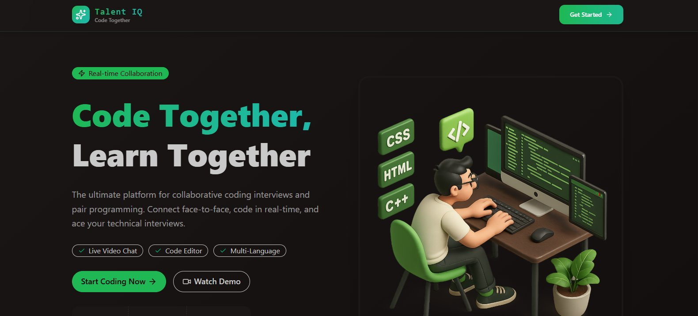
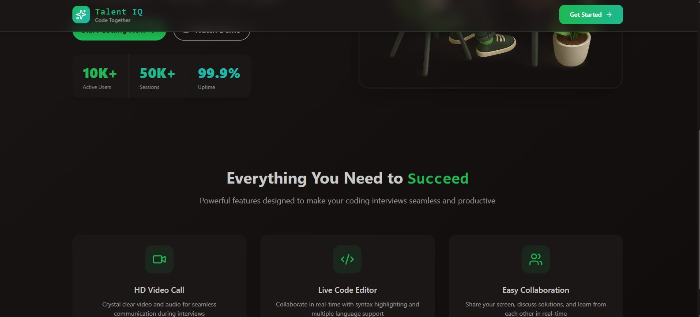
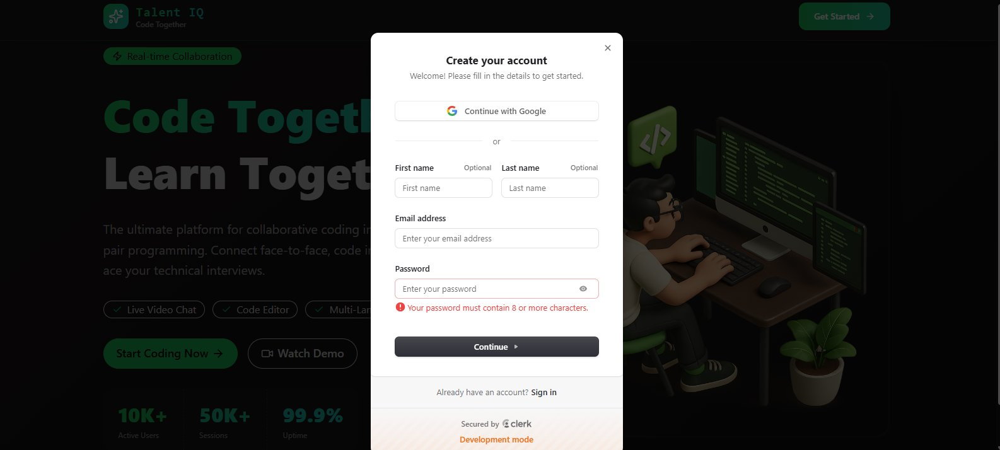
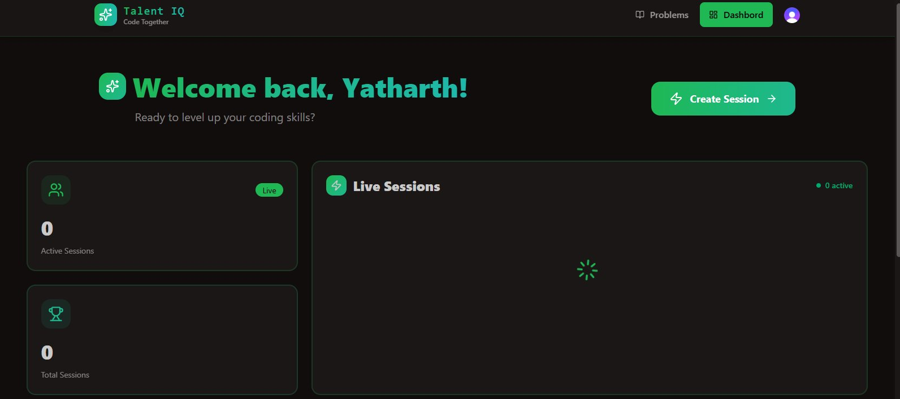
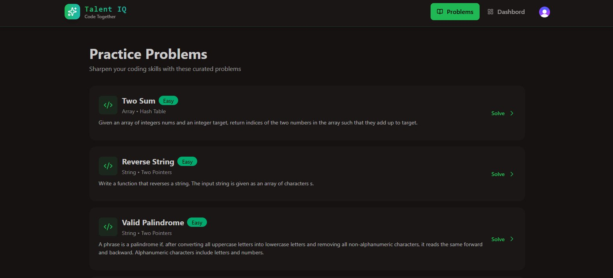

<div align="center">


# ⚡ TalentIQ — Real-Time Collaborative Coding Platform

### *Code Together. Learn Together. Ace Your Interviews.*

[](https://talent-iq-jet.vercel.app/)
[](LICENSE)
[](https://nodejs.org)
[](https://reactjs.org)
[](https://mongodb.com)
[](https://clerk.dev)

<br/>

> **TalentIQ** is a production-deployed real-time collaborative coding platform built for technical interview simulations. Interviewers and candidates connect face-to-face via HD video, code together in a live editor, and practice DSA problems — all in one seamless experience.

<br/>



</div>

---

## 🌟 Why This Project Stands Out

| Feature | Detail |
|---|---|
| 🎥 **HD Live Video + Audio** | Real-time video calls powered by Stream SDK for interview simulations |
| 💻 **Collaborative Code Editor** | Syntax-highlighted live code editor with multi-language support |
| 🔐 **Clerk Auth (OAuth + MFA)** | Google OAuth, email/password, and multi-factor authentication |
| 🧩 **Practice Problems** | Curated DSA problems (Two Sum, Palindrome, etc.) with difficulty tags |
| 📊 **Session Dashboard** | Track active sessions, total sessions, and live interview history |
| 🚀 **Production Deployed** | Vercel (frontend) — live and accessible globally |

---

## 📸 Screenshots

<div align="center">

### 🏠 Hero — Real-Time Collaboration Landing


### 📊 Platform Stats & Feature Highlights


| 🔐 Clerk Auth — OAuth + Email | 📋 User Dashboard — Live Sessions |
|:---:|:---:|
|  |  |

### 🧩 Practice Problems — DSA Problem Bank


</div>

---

## 🏛️ System Architecture

```
┌──────────────────────────────────────────────────────────────┐
│                    CLIENT (React.js + Vite)                   │
│   Clerk Auth UI │ Stream Video SDK │ Redux │ Tailwind CSS     │
└─────────────────────────┬────────────────────────────────────┘
                          │ REST API + WebSocket
┌─────────────────────────▼────────────────────────────────────┐
│                  SERVER (Node.js + Express.js)                 │
│   REST Controllers │ Auth Middleware │ MongoDB Schemas        │
└───────────┬──────────────────────────────┬───────────────────┘
            │                              │
┌───────────▼──────────┐      ┌────────────▼────────────────┐
│   MongoDB Atlas       │      │   Stream SDK (GetStream.io) │
│   (Sessions, Users,   │      │   Real-time Video / Audio   │
│    Problems, Recordings)│    │   Chat + WebRTC             │
└──────────────────────┘      └─────────────────────────────┘
            │
┌───────────▼──────────┐
│   Clerk (Auth Layer)  │
│   OAuth, MFA, JWT     │
└──────────────────────┘
```

---

## ✨ Features

### 🎙️ Real-Time Interview Room
- HD video and audio via Stream SDK WebRTC
- Collaborative live code editor with syntax highlighting
- Multi-language support (JavaScript, Python, C++, Java, and more)
- Real-time chat alongside the code editor
- Session recording and playback support

### 📊 Dashboard
- View all active and past interview sessions
- Create new sessions with one click
- Track total sessions completed
- Live session status indicator

### 🧩 Practice Problems
- Curated DSA problem bank with difficulty levels (Easy / Medium / Hard)
- Problems tagged by category (Array, String, Two Pointers, Hash Table)
- Clean problem descriptions matching LeetCode-style format

### 🔐 Authentication
- **Clerk Auth** with OAuth (Google), email/password
- **MFA** (Multi-Factor Authentication) support
- Secure session tokens with automatic refresh
- Protected routes — unauthenticated users redirected to login

---

## 🛠️ Tech Stack

### Frontend
| Technology | Purpose |
|---|---|
| React.js 18 + Vite | Fast SPA with component-based UI |
| Tailwind CSS | Utility-first dark-themed design system |
| Stream Video SDK | WebRTC-powered HD video/audio calls |
| Clerk React SDK | Auth UI components + session management |
| React Router v6 | Client-side routing with protected routes |
| Axios | HTTP client for REST API communication |

### Backend
| Technology | Purpose |
|---|---|
| Node.js + Express.js | RESTful API server |
| MongoDB + Mongoose | NoSQL database for sessions, users, problems |
| Clerk Backend SDK | Server-side JWT verification |
| Stream Node SDK | Server-side Stream token generation |
| WebSockets | Real-time bidirectional communication |

### Cloud & Services
| Service | Role |
|---|---|
| MongoDB Atlas | Managed cloud database |
| Stream SDK (GetStream.io) | Real-time video/audio/chat infrastructure |
| Clerk | Authentication-as-a-service (OAuth + MFA) |
| Vercel | Frontend hosting & CI/CD |

---

## 📁 Project Structure

```
TalentIQ/
├── 📂 src/                          # React Frontend
│   ├── 📂 components/
│   │   ├── 📂 Interview/            # Video room, code editor, chat
│   │   ├── 📂 Dashboard/            # Session cards, stats
│   │   ├── 📂 Problems/             # DSA problem list & solver
│   │   └── 📂 Common/               # Navbar, buttons, loaders
│   ├── 📂 pages/                    # Route-level pages
│   │   ├── HomePage.jsx
│   │   ├── DashboardPage.jsx
│   │   ├── InterviewRoom.jsx
│   │   └── ProblemsPage.jsx
│   ├── 📂 hooks/                    # Custom React hooks
│   ├── 📂 lib/                      # Stream & Clerk config
│   └── 📂 store/                    # Redux / state management
│
├── 📂 server/                       # Express Backend
│   ├── 📂 controllers/
│   │   ├── session.controller.js    # Session CRUD
│   │   ├── user.controller.js       # User management
│   │   └── stream.controller.js     # Stream token generation
│   ├── 📂 models/
│   │   ├── Session.js               # Interview session schema
│   │   ├── User.js                  # User profile schema
│   │   └── Problem.js               # DSA problem schema
│   ├── 📂 routes/                   # Express route definitions
│   ├── 📂 middleware/               # Clerk auth middleware
│   └── index.js                     # Server entry point
│
└── 📄 README.md
```

---

## 🗄️ Database Schema (Key Models)

```js
// Session Model
{
  title,                    // Interview session title
  description,              // Session description
  status,                   // "upcoming" | "live" | "completed"
  startTime,                // Scheduled start time
  streamCallId,             // Stream SDK call reference
  participants: [ref → User],
  createdBy: ref → User,
  recordingUrl              // Cloudinary / Stream recording URL
}

// User Model
{
  clerkId,                  // Clerk external user ID
  name, email, image,
  sessionsCreated: [ref → Session],
  sessionsJoined:  [ref → Session]
}

// Problem Model
{
  title, difficulty,        // "Easy" | "Medium" | "Hard"
  category,                 // "Array", "String", "DP", etc.
  description,
  examples, constraints,
  starterCode              // Default code template
}
```

---

## 🚀 Getting Started

### Prerequisites
- Node.js v18+
- MongoDB Atlas account
- Clerk account (free tier works)
- Stream (GetStream.io) account (free tier works)

### 1. Clone the repository
```bash
git clone https://github.com/prashantsaraswat1/TalentIQ.git
cd TalentIQ
```

### 2. Setup Backend
```bash
cd server
npm install
```

Create `server/.env`:
```env
MONGODB_URI=your_mongodb_atlas_uri
PORT=5000

# Clerk
CLERK_SECRET_KEY=sk_test_your_clerk_secret

# Stream SDK
STREAM_API_KEY=your_stream_api_key
STREAM_API_SECRET=your_stream_api_secret
```

### 3. Setup Frontend
```bash
cd ..
npm install
```

Create `.env`:
```env
VITE_CLERK_PUBLISHABLE_KEY=pk_test_your_clerk_key
VITE_STREAM_API_KEY=your_stream_api_key
VITE_API_BASE_URL=http://localhost:5000/api
```

### 4. Run the app
```bash
# Terminal 1 — Backend
cd server && npm run dev

# Terminal 2 — Frontend
npm run dev
```

Open `http://localhost:5173` 🎉

---

## 🔌 API Reference

| Method | Endpoint | Auth | Description |
|---|---|---|---|
| `GET` | `/api/sessions` | ✅ Clerk | Get all sessions for user |
| `POST` | `/api/sessions` | ✅ Clerk | Create new interview session |
| `GET` | `/api/sessions/:id` | ✅ Clerk | Get session details |
| `DELETE` | `/api/sessions/:id` | ✅ Clerk | Delete a session |
| `POST` | `/api/stream/token` | ✅ Clerk | Generate Stream video token |
| `GET` | `/api/problems` | ✅ Clerk | Get all practice problems |
| `GET` | `/api/problems/:id` | ✅ Clerk | Get single problem |
| `GET` | `/api/users/me` | ✅ Clerk | Get current user profile |

---

## ⚡ Technical Highlights

- **Stream SDK WebRTC** — sub-200ms latency video/audio for interview sessions
- **Clerk MFA** — enterprise-grade auth without building it from scratch
- **Real-time code sync** — WebSocket-powered collaborative editor
- **MongoDB schema design** — normalized session/user/problem relations
- **Protected routing** — Clerk middleware guards both frontend routes and backend APIs
- **Responsive dark UI** — Tailwind CSS with custom green accent design system

---

## 🚢 Deployment

| Layer | Platform | Status |
|---|---|---|
| Frontend | Vercel | [](https://talent-iq-jet.vercel.app/) |
| Database | MongoDB Atlas | ✅ Live |
| Auth | Clerk | ✅ Live |
| Video/Chat | Stream SDK | ✅ Live |

---

## 🔮 Future Roadmap

- [ ] **AI Mock Interviewer** — GPT-powered interviewer that asks questions in real-time
- [ ] **Code Execution Engine** — Run and test code inside the editor (Judge0 API)
- [ ] **Session Recordings Playback** — Review past interview recordings
- [ ] **Leaderboard** — Track top performers across practice problems
- [ ] **TypeScript migration** — End-to-end type safety
- [ ] **Docker containerization** — Simplified local setup and deployment
- [ ] **Mobile app** — React Native version for on-the-go practice

---

## 🤝 Contributing

Contributions are welcome!

1. Fork the repository
2. Create a feature branch: `git checkout -b feature/amazing-feature`
3. Commit your changes: `git commit -m 'feat: add amazing feature'`
4. Push: `git push origin feature/amazing-feature`
5. Open a Pull Request

---

## 📄 License

Distributed under the MIT License. See [LICENSE](LICENSE) for more information.

---

## 👨‍💻 Author

<div align="center">

**Prashant Saraswat**
*Full Stack Developer | MERN Stack | Real-Time Systems | Cloud Deployment*

[](https://portfolio-website-seven-xi-14.vercel.app/)
[](https://linkedin.com/in/prashant-saraswat-372116357)
[](https://github.com/prashantsaraswat1)
[](mailto:prashantsaraswat48@gmail.com)

---

### 🔗 Also check out my other projects
[](https://study-notion-taupe-beta.vercel.app/)

</div>

---

<div align="center">

**If TalentIQ impressed you, please ⭐ star the repo — it really helps!**

*Made with ❤️ and a lot of ☕ by Prashant Saraswat*

</div>
